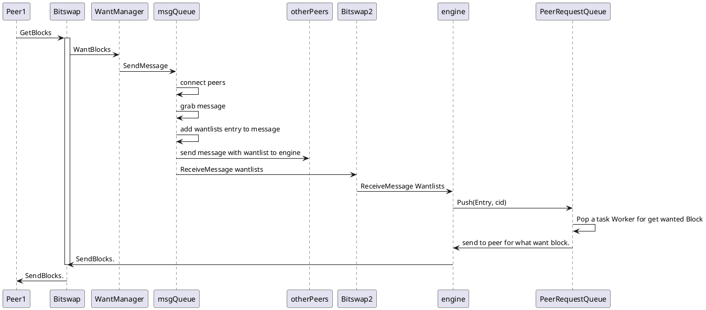

## bitswap 模块

```plantuml
@startuml
Peer1 -> Bitswap: GetBlocks
activate Bitswap
Bitswap -> WantManager: WantBlocks
WantManager -> msgQueue: SendMessage
msgQueue -> msgQueue: connect peers
msgQueue -> msgQueue: grab message 
msgQueue -> msgQueue: add wantlists entry to message
msgQueue -> otherPeers: send message with wantlist to engine 
msgQueue -> Bitswap2: ReceiveMessage wantlists
Bitswap2  -> engine: ReceiveMessage Wantlists
engine  -> PeerRequestQueue: Push(Entry, cid)
PeerRequestQueue -> PeerRequestQueue: Pop a task Worker for get wanted Block
PeerRequestQueue -> engine: send to peer for what want block.
engine -> Bitswap : SendBlocks.
deactivate Bitswap
Bitswap -> Peer1 : SendBlocks.

@enduml
```