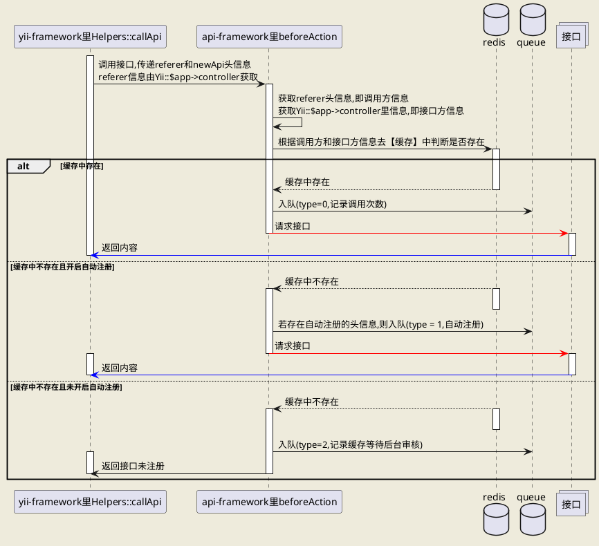

## flow example

```plantuml
@startuml
skinparam backgroundColor #EEEBDC
participant "yii-framework里Helpers::callApi" as A
participant "api-framework里beforeAction" as B
database "redis" as C
database "queue" as D
collections  "接口" as E
activate A
A -> B: 调用接口,传递referer和newApi头信息\nreferer信息由Yii::$app->controller获取
activate B
B -> B: 获取referer头信息,即调用方信息\n获取Yii::$app->controller里信息,即接口方信息
B -> C: 根据调用方和接口方信息去【缓存】中判断是否存在
alt 缓存中存在
activate C
C --> B: 缓存中存在
deactivate C
B -> D: 入队(type=0,记录调用次数)
B -[#red]> E : 请求接口
deactivate B
activate E
E -[#0000FF]> A: 返回内容
deactivate E
deactivate A
else 缓存中不存在且开启自动注册
C --> B: 缓存中不存在
activate C
deactivate C
activate B
B -> D: 若存在自动注册的头信息,则入队(type = 1,自动注册)
B -[#red]> E : 请求接口
deactivate B
activate E
activate A
E -[#0000FF]> A: 返回内容
deactivate E
deactivate A
else 缓存中不存在且未开启自动注册
C --> B: 缓存中不存在
activate C
deactivate C
activate B
B -> D: 入队(type=2,记录缓存等待后台审核)
activate A
B -> A: 返回接口未注册
deactivate A
deactivate B
end
@enduml
```